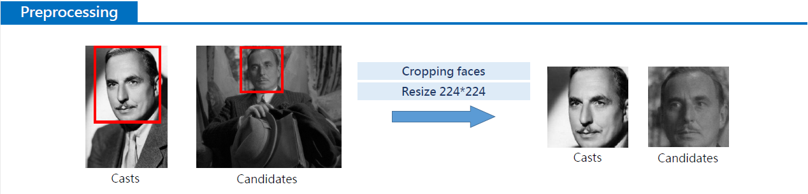
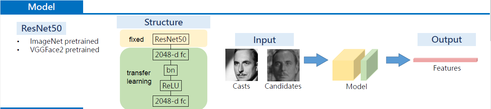
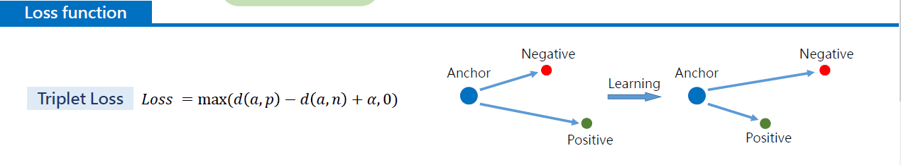
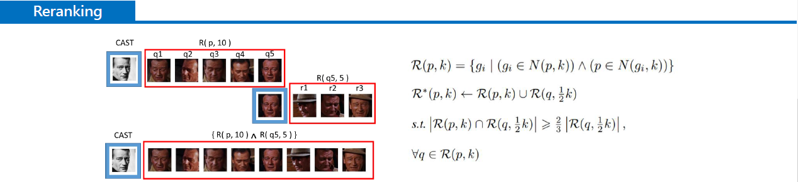
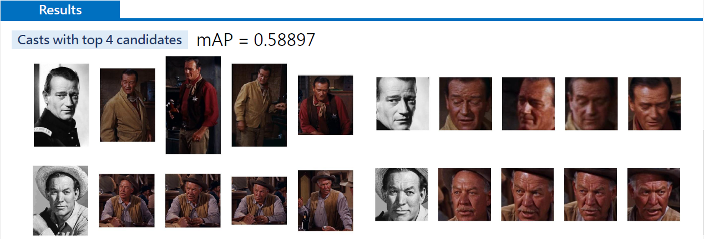

# Final Project - Cast Search by Portrait Challenge
Deep Learning for Computer Vision (2019 Spring) Group 36  

## Task Definition
Given an image of a query image and some candidate images from gallery, we want to find the best candidate images with the same person as the person in the query image (sorted by confidence).

## Solutions and Experiment
### Our Best Solution: 
We considered the task as an Image Selection problem, or Person Re-Identification (re-ID) problem for person datasets, and used Contrastive Representation Learning and Re-Ranking algorithm to solve this problem. 

Given all images, we trained our model by Triplet Loss to extract features such that distance between features extracted from images of the same people is smaller, and vice versa. Having the distances between the query image and all candidate images, the best candidate images should be those with the smallest distance to the query image. However, before outputing the result, we preformed a k-reciprocal encoding re-ranking algotirhms [1] to the distances and get more robust revised distances as most re-ID works did. Then we output the final re-ranked results with the smallest revised distances.

## Workflow of our best solution: Person Re-Identification and Re-Ranking

### 1. Dataset Preprocessing: crop human faces with pre-trained face detection model [2]

  

### 2. Model Design: pre-trained Resnet50 (with Imagenet/VGGFace2) and additional feature extracting layers

  

### 3. Training: train our model with Triplet Loss to output feature representations of the faces, such that the distance between features of different faces is long and distance between features same faces is close.

  

### 4. Inferencing: Extract features of all queries and candidates with trained model, perform the re-ranking alrogithm to the features to get the revised distances, and output the final re-ranked results (to a cvs file) with the smallest revised distances.
<!-- calculate distance between all queries and candidates with either cosine similarity function or re-ranking function. Output the ranking order as csv format finally. -->

  

### 5. Validation: When inferencing on validation dataset, we has ground truth to calculate mAP scores to measure accuracy of our model. The following picture is the visualization of our infenence re-ranking result of the testset, and our best mAP on testset from the Kaggle leaderboard is 58.897%.

  

# Usage of codes to reproduce our results
### 0. Clone the project repository
Clone this repository to your local machine by using the following command.

    git clone https://github.com/ugotsuyokunaru/DLCV-final_project.git

### 1. Download the dataset
In the starter code of this repository, we have provided a shell script for downloading and extracting the origin dataset for this project. For Linux users, simply use the following command:

    sh ./get_dataset.sh IMDB

The shell script will automatically download the dataset and store the data in a folder called `IMDB`. Note that this command by default only works on Linux. If you are using other operating systems, you should download the dataset from [this link](https://drive.google.com/drive/folders/1GItzg9wJBiPFrDPBUXQdZgs1ac0Wwbju?usp=sharing
) and unzip the compressed file manually. Remember to put the unzip folder in folder named `IMDB`.

### 2. Dataset preprocessing: Face Cropping
Before training, crop and save the human faces from the original images.  

(1) Cropping by codes (codes credited to [2])

Proprocess the images by typing the following command:

    python3 ./preprocess/face.evoLVe.PyTorch/align/face_align.py --source_root ./IMDb/<dataset_type> --dest_root ./IMDb_resize/<dataset_type> --crop_size 224

⚠️ Remember to change `<dataset_type>` to actual folder name like "train", "val", "test".

(2) Download our cropped dataset directly 

Because cropping dataset is very time consuming, you could just download the cropped dataset directly from google drive through the following command.

    sh get_cropped_data.sh

<!-- Shell script has to makedir ./IMDb_resize/ folder, unzip the zip files, and remove the zip files. -->

### 3. Training
First, download the pre-trained model by the following command:

    sh get_res50model.sh

This command would download the pre-trained model to folder `pretrain`.

Then, to reproduce our best model, train the model with the following command:
  
    python3 train.py

### 4. Validation

Download our trained model first by the following command:
  
    sh get_model.sh

Perform validation by the following command:

    python3 inference_csv.py --action val --out_folder ./inference/val

We have a re-ranking algorithm, which can provide a large improve of mAP. If using cosine similarity to calculate distance only, the maximum mAP is `47.05%` on validation set in our experiments. By applying the re-ranking algorithm, we got a maximum of `8% improvement` on mAP to about `55%`, and we find that `(k1, k2, lambda) = (40, 6, 0.1)` works best:

|  k1   |  k2   | lambda |  mAP   |
| :---: | :---: | :----: | :----: |
|  40   |   6   |  0.0   | 0.5460 |
|  40   |   6   |  0.1   | 0.5528 |
|  40   |   6   |  0.2   | 0.5524 |
|  40   |   6   |  0.3   | 0.5513 |
|  40   |   6   |  0.4   | 0.5490 |
|  40   |   6   |  0.5   | 0.5451 |

|  k1   |  k2   | lambda |  mAP   |
| :---: | :---: | :----: | :----: |
|  10   |   6   |  0.1   | 0.5367 |
|  20   |   6   |  0.1   | 0.5523 |
|  40   |   6   |  0.1   | 0.5528 |
|  50   |   6   |  0.1   | 0.5499 |

|  k1   |  k2   | lambda |  mAP   |
| :---: | :---: | :----: | :----: |
|  40   |   6   |  0.1   | 0.5528 |
|  40   |  12   |  0.1   | 0.5498 |
|  40   |  18   |  0.1   | 0.5387 |

### 5. Inferencing

Generate a file `rerank.csv` in ./inference/test for Kaggle submission by the following command:

    python3 inference_csv.py --action test --out_folder ./inference/test

### 6. Visualization

To visualize the re-ranked sorted result, please run the code:

    python3 visual.py

### Packages
Below is a list of packages required for this project:

> [`python`](https://www.python.org/): 3.5+  
> [`torch`](https://pytorch.org/): 1.0  
> [`h5py`](https://www.h5py.org/): 2.9.0  
> [`numpy`](http://www.numpy.org/): 1.16.2  
> [`pandas`](https://pandas.pydata.org/): 0.24.0  
> [`torchvision`](https://pypi.org/project/torchvision/): 0.2.2  
> [`cv2`](https://pypi.org/project/opencv-python/)
> [`matplotlib`](https://matplotlib.org/)
> [`skimage`](https://scikit-image.org/)
> [`Pillow`](https://pillow.readthedocs.io/en/stable/)
> [`scipy`](https://www.scipy.org/)  
> [The Python Standard Library](https://docs.python.org/3/library/)

<!-- Note that using packages with different versions will very likely lead to compatibility issues, so make sure that you install the correct version if one is specified above. -->

### Referrence

[1] The K-reciprocal Encoding Re-Ranking algorithm we used is proposed by [Re-ranking Person Re-identification with K-reciprocal Encoding](http://openaccess.thecvf.com/content_cvpr_2017/papersZhong_Re-Ranking_Person_Re-Identification_CVPR_2017_paper.pdf)

[2] The pre-trained Face Detection model we used is trained by [face.evoLVe: High-Performance Face Recognition Library based on PyTorch](https://github.com/ZhaoJ9014/face.evoLVe.PyTorch)

[3] Our codes are based on the codes of [Person_reID_baseline_pytorch](https://github.com/layumi/Person_reID_baseline_pytorch)